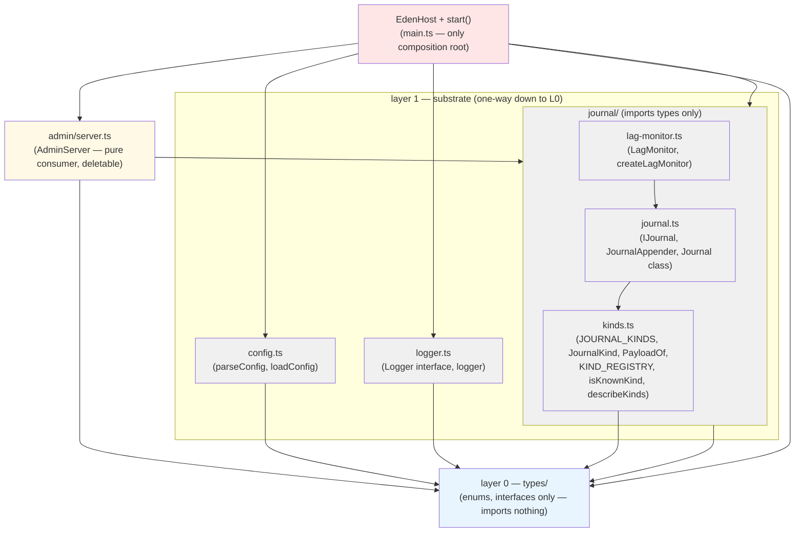
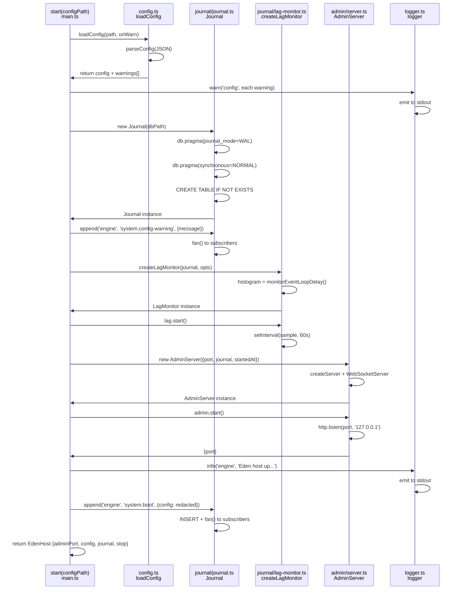
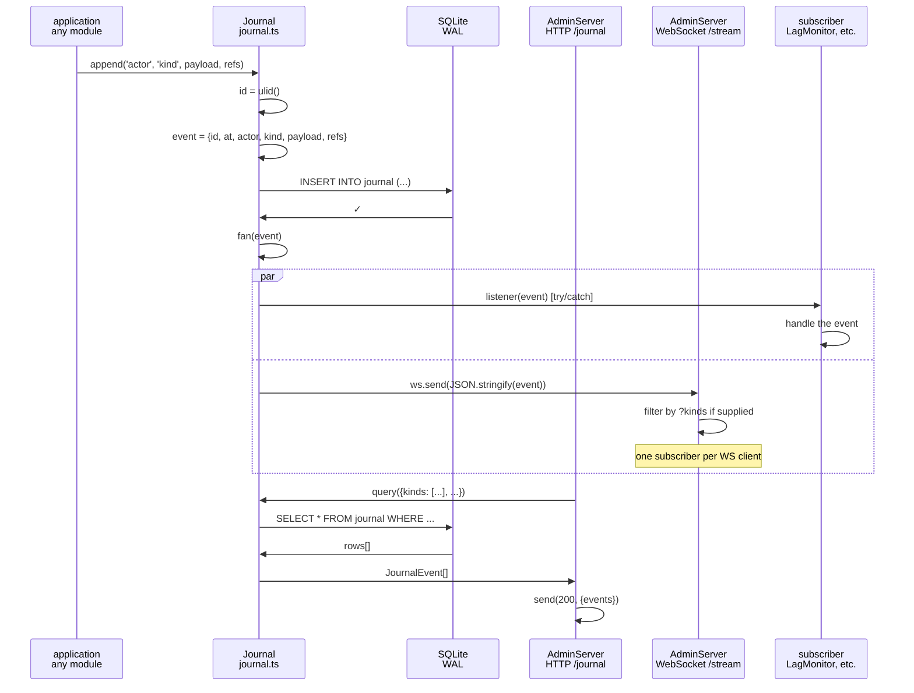

# 15 — M0 spine: as-built UML

This document captures the ACTUAL M0 implementation (only what's built under
`eden/src/` and `eden/tests/fakes/`), not the full M0–M7 design (which lives in
[11-class-model.md](11-class-model.md) and [12-architecture-views.md](12-architecture-views.md)).
When the code and design diverge, the code wins; note the seam.

## 1. Package / layer diagram



**Dependency law (M0):** types/ (L0) ← config + logger + journal/ (L1) ← admin/
(consumer) ← main.ts (composition root). Layers 2–3 (skills, llm, god, villagers,
social) are **not yet built**. Each layer respects its rule:
- **L0 (types/):** pure data & interfaces, imports nothing
- **L1 (config, logger, journal/):** substrate, imports only L0
- **Admin:** reads from journal; nothing imports it except main
- **Main:** wires everything, imports all

## 2. Class diagram

```mermaid
classDiagram
    direction LR

    %% ── Layer 0 enums ──────────────────────────────────────────────
    class Tier {
        <<enumeration>>
        mortal
        divine
    }
    class SkillStatus {
        <<enumeration>>
        draft
        active-probation
        active
        quarantined
        archived
    }
    class AbortCause {
        <<enumeration>>
        preempted
        stalled
        timeout
    }
    class Priority {
        <<enumeration>>
        background
        normal
        interrupt
    }

    %% ── Layer 0 journal interfaces ──────────────────────────────────
    class Refs {
        runId?: string
        rolloutId?: string
        taskId?: string
        verdictId?: string
        directiveId?: string
        skill?: string
        skillVersion?: number
        conversationId?: string
        tradeId?: string
        llmCallId?: string
    }

    class JournalEvent {
        id: string
        at: number
        actor: string
        kind: string «dispatch key»
        payload: object
        refs: Refs
    }

    class JournalQuery {
        kinds?: string[]
        actor?: string
        ref?: string
        since?: number
        until?: number
        limit?: number
    }

    %% ── Layer 0 event types ────────────────────────────────────────
    class EdenEvent {
        <<union: 13 variants»
        type: EventType
    }

    class Subscription {
        id: string
        villager: string
        on: EventType
        filter?: Filter
        handler: SkillHandler | DeliberateHandler
        cooldownMs?: number
        source: role-default | self | god | admin
        enabled: boolean
    }

    class Inbox {
        <<interface»
        deliver(m: InboxMessage)
        drain(): InboxMessage[]
    }

    class InboxMessage {
        from: god | villager
        kind: directive | critique | tell
        payload: object
        at: number
    }

    %% ── Layer 0 task types (defined, no M0 consumer) ────────────────
    class Task {
        <<defined, used from M1+»
        id: string
        goal: string
        assignee?: string
        successCriteria: string
        check?: ItemCheck
        context: string
        maxRetries: number
        parent?: string
        currentRolloutId?: string
    }

    class Verdict {
        <<defined, used from M3+»
        ticketId: string
        success: boolean
        score?: number
        critique: string
        libraryAction: admit | keep-draft | quarantine | archive | none
        followUp?: DirectiveSuggestion | TaskSuggestion
        praise?: string
    }

    %% ── Layer 0 skill types (defined, no M0 consumer) ───────────────
    class SkillVersion {
        <<defined, used from M2+»
        name: string
        version: number
        codePath: string
        codeHash: string
        status: SkillStatus
        probationRunsLeft?: number
        author: Author
        provenance?: Provenance
        createdAt: number
    }

    class RunReport {
        <<defined, used from M2+»
        runId: string
        rolloutId?: string
        skill: string
        version: number
        villager: string
        args: object
        outcome: RunOutcome
        aborted?: AbortCause
        startedAt: number
        durationMs: number
        pulses: number
        deepestDepth: number
        callTree: CallFrame[]
        worldBefore: Snapshot
        worldAfter: Snapshot
    }

    %% ── Layer 1: config ────────────────────────────────────────────
    class EdenConfig {
        minecraft: { host, port, version }
        villagers: VillagerConfig[]
        god: { name, gamemode, authoring, desks, budget, ... }
        behavior: { drives }
        llm: { providers, maxConcurrent, perVillagerCooldownSeconds }
        skills: { runDefaultTimeoutMs, stallSeconds, ... }
        settlement: { url }
        admin: { port }
        journal: { vitalsIntervalSeconds, debugPrompts, retentionDays }
    }

    class DeskConfig {
        model: strong | fast
    }

    class ProviderConfig {
        baseUrl: string
        model: string
        inputTokenBudget: number
    }

    class VillagerConfig {
        name: string
        role: string
        home: [x, y, z]
        chest: [x, y, z]
    }

    %% ── Layer 1: logger ────────────────────────────────────────────
    class Logger {
        <<interface»
        line(actor: string, msg: string, ms?: number)
        info(actor: string, msg: string)
        warn(actor: string, msg: string)
        error(actor: string, msg: string)
    }

    %% ── Layer 1: journal kinds (S1 registry seam) ──────────────────
    class JournalKind {
        <<type union (journal/kinds.ts)»
        system.boot
        system.config-warning
        system.bot-connected
        system.bot-disconnected
        system.error
        system.loop-lag
    }

    class KindPayloads {
        <<interface (per-kind map)»
        system.boot: { config: object }
        system.config-warning: { message: string }
        system.bot-connected: { name: string }
        system.bot-disconnected: { name, reason? }
        system.error: { message, stack? }
        system.loop-lag: { p99, max }
    }

    class KIND_REGISTRY {
        <<object (S1 registry)»
        system.boot: KindDoc
        ... « 6 kinds total »
    }

    %% ── Layer 1: journal implementation ────────────────────────────
    class IJournal {
        <<interface»
        append~K~(actor: string, kind: K, payload: PayloadOf~K~, refs?: Refs): string
        query(q?: JournalQuery): JournalEvent[]
        subscribe(listener: JournalListener): Unsubscribe
    }

    class JournalAppender {
        <<type alias»
        Pick~IJournal, append~
    }

    class Journal {
        <<class»
        -db: Database
        -listeners: Set~JournalListener~
        -insertStmt: Statement
        constructor(dbPath: string)
        append~K~(actor, kind, payload, refs): string
        query(q?: JournalQuery): JournalEvent[]
        subscribe(listener): Unsubscribe
        count(): number
        close(): void
        -fan(event): void
    }

    class LagMonitorOptions {
        resolutionMs?: number «20ms»
        thresholdMs?: number «1000ms hardcoded»
        resetMs?: number «60s»
    }

    class LagSample {
        lagged: boolean
        p99: number
        max: number
    }

    class LagMonitor {
        <<interface (D-07 canary)»
        sample(): LagSample
        start(): void
        stop(): void
        readonly thresholdMs: number
    }

    %% ── Consumer: admin server ─────────────────────────────────────
    class AdminServer {
        <<pure consumer, deletable»
        -http: Server
        -wss: WebSocketServer
        -journal: Pick~IJournal, query|subscribe~
        -getStatus: () => object
        -startedAt: number
        -boundPort: number
        constructor(opts: AdminServerOptions)
        start(): Promise~{port}~
        stop(): Promise~void~
        +port: number
        -route(req, res): void
    }

    %% ── Composition root ───────────────────────────────────────────
    class EdenHost {
        <<interface»
        readonly adminPort: number
        readonly config: EdenConfig
        readonly journal: Journal
        stop(): Promise~void~
    }

    %% ── Test fakes (test-only, not shipped) ────────────────────────
    class MemoryJournal {
        <<test-only»
        events: JournalEvent[]
        constructor(now?: () => number)
        append~K~(actor, kind, payload, refs): string
        query(q?: JournalQuery): JournalEvent[]
        subscribe(listener): Unsubscribe
    }

    class FakeBot {
        <<test-only»
        username: string
        entity: { position: Vec3 }
        game: { dimension }
        inventory: { items: () => FakeItem[] }
        currentWindow: FakeWindow | null
        clicks: ClickRecord[]
        autoEat: { enabled, isEating, ... }
        armorManager: { paused, equipAll }
    }

    class ScriptedLlm {
        <<test-only»
        url: string
        port: number
        requests: any[]
        queue: ScriptedTurn[]
        static start(turns?: ScriptedTurn[]): Promise~ScriptedLlm~
        enqueue(...turns): this
        close(): Promise~void~
        -handle(req, res): void
    }

    %% ── Relationships ──────────────────────────────────────────────
    Journal ..|> IJournal
    MemoryJournal ..|> IJournal
    AdminServer --> IJournal: "Pick<query|subscribe>"
    EdenHost --> Journal: "owns"
    EdenHost --> AdminServer: "owns"
    EdenHost --> LagMonitor: "owns"
    EdenHost --> EdenConfig: "holds"
    LagMonitor --> JournalAppender: "appends to"
    JournalEvent --> Refs: "contains"
    JournalKind --|> JournalEvent: "kind dispatch"
    KindPayloads --|> JournalKind: "per-kind union"
    KIND_REGISTRY --|> JournalKind: "S1 registry"
    SkillVersion --> Tier: "references"
    SkillVersion --> SkillStatus: "has status"
    RunReport --> AbortCause: "may have"
    RunReport --> CallFrame: "contains []"
    Subscription --> Priority: "optional"
    Subscription --> EdenEvent: "listens for"
    EdenConfig --> DeskConfig: "contains"
    EdenConfig --> ProviderConfig: "contains"
    EdenConfig --> VillagerConfig: "contains []"
    Verdict --> Task: "references"

    classDef enum fill:#fff3cd,stroke:#856404
    classDef interface fill:#d1ecf1,stroke:#0c5460
    classDef impl fill:#d4edda,stroke:#155724
    classDef registry fill:#f8d7da,stroke:#721c24
    classDef consumer fill:#fff9e6,stroke:#856404
    classDef testonly fill:#e8e8e8,stroke:#666
    classDef config fill:#e7d4f5,stroke:#5a2d8c

    class Tier,SkillStatus,AbortCause,Priority enum
    class IJournal,Logger,LagMonitor,EdenHost,Inbox interface
    class Journal,AdminServer,EdenConfig,DeskConfig,ProviderConfig,VillagerConfig impl
    class JournalKind,KindPayloads,KIND_REGISTRY registry
    class MemoryJournal,FakeBot,ScriptedLlm testonly
```

### S1 Registry seam (the code divergence from docs/11)

The **JournalKind union + per-kind payloads** live in `journal/kinds.ts` (S1: registry,
`satisfies` exhaustiveness), while `types/JournalEvent.kind` is `string` — types/ imports
nothing (the law), so the canonical kinds can't live there. The sole writer
(`journal.ts`) enforces the union at its generic `append<K>` signature:

```typescript
// journal/kinds.ts (source of truth)
export type JournalKind = 'system.boot' | 'system.config-warning' | ...
export interface KindPayloads {
  'system.boot': { config: object },
  'system.config-warning': { message: string },
  ...
}

// types/journal.ts (event stays generic)
export interface JournalEvent {
  kind: string  // <- dispatch key, typed by the writer
  payload: object
}

// journal/journal.ts (enforces union)
append<K extends JournalKind>(actor: string, kind: K, payload: PayloadOf<K>, ...): string
```

This is **the v1 failure mode #2 fix**: one source of truth (the registry), compiler-enforced
(a `PayloadOf<K>` indexing a missing kind is a compile error).

## 3. Boot sequence



**Key sequence facts:**
1. **Config load:** warnings collected, NOT printed (config can't import logger per the law);
   caller logs each warning AND journals it as `system.config-warning`
2. **Journal:** opened in WAL mode, synchronous=NORMAL (D-07: safe for event loop)
3. **Lag monitor:** started with 60s reset window; threshold 1000ms is **hardcoded**, not a
   config key (D-07, S7)
4. **Admin server:** HTTP + WebSocket on `127.0.0.1:port` (localhost only)
5. **Boot event:** journaled with config snapshot (secrets redacted) AFTER admin is live,
   so the first reader can't race the server startup

## 4. Runtime data paths

### (a) Append fan-out



**Append contract (P4):** if a module calls `journal.append`, it journaled. Fan-out is
best-effort: a subscriber that throws (try/catch) never breaks the write path or other
subscribers. The write is synchronous; fan-out is in-process, all one microtask.

### (b) Lag canary sample cycle (D-07)

```mermaid
sequenceDiagram
    participant loop as event loop<br/>Node.js
    participant timer as setInterval()<br/>lag-monitor.ts
    participant histogram as monitorEventLoopDelay<br/>perf_hooks
    participant journal as Journal
    participant db as SQLite

    loop->>loop: [60s timer fires]
    
    timer->>histogram: sample(): max/p99
    histogram->>histogram: read histogram.max, histogram.percentile(99)
    histogram->>timer: {lagged, p99, max}
    
    alt max ≥ 1000ms
        timer->>journal: append('engine', 'system.loop-lag', {p99, max})
        journal->>db: INSERT
        journal->>journal: fan() to subscribers
    else
        timer->>timer: [silent, under threshold]
    end
    
    histogram->>histogram: reset()
    timer->>timer: [armed for next 60s]
    
    note over timer: The threshold (1000ms) is HARDCODED, not a config key.<br/>Per-tick PULSES are in-memory only — never journaled (R44, D-07).
```

**Per-tick pulses:** skill runs emit `PulseEvent` (in-memory), journal only end-of-run
and summaries. The lag monitor is the **backpressure canary** (R40, D-07): when event-loop
stalls spike, `system.loop-lag` appears in the journal so observability can spot GC/CPU
runaway *before* it cascades.

---

## Invariants visible in M0

- **S1 (registry):** JournalKind union + per-kind payloads in one place, compiler-enforced
- **S2 (single writer):** only `Journal.append` writes the table; 6 concurrent readers OK
- **S5 (no DI):** wiring is plain constructor args in `start()`, no singletons or container
- **R23 (stdout purity):** `console.*` only in `logger.ts` (ESLint enforces this)
- **D-07 (backpressure canary):** lag threshold 1000ms hardcoded, not a config knob —
  drives the spike monitoring contract
- **P4 (journaling):** if it didn't journal, it didn't happen — every state change appends
  first
- **Admin deletability:** removing `admin/` breaks nothing; it's a pure read consumer

---

## Pointer to docs/PROGRESS.md

See `docs/PROGRESS.md` for session notes and M1–M7 planning.
