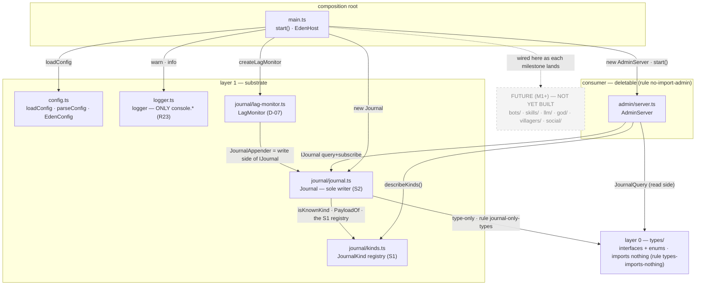
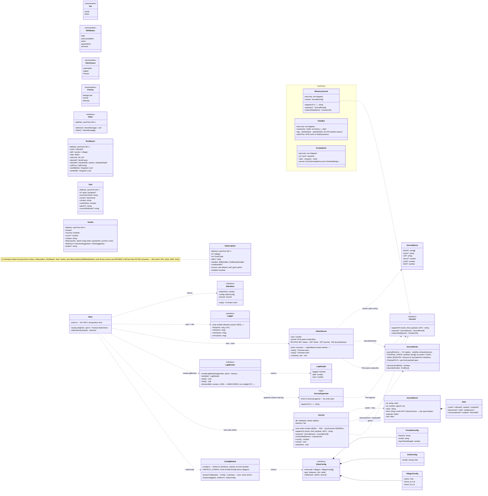
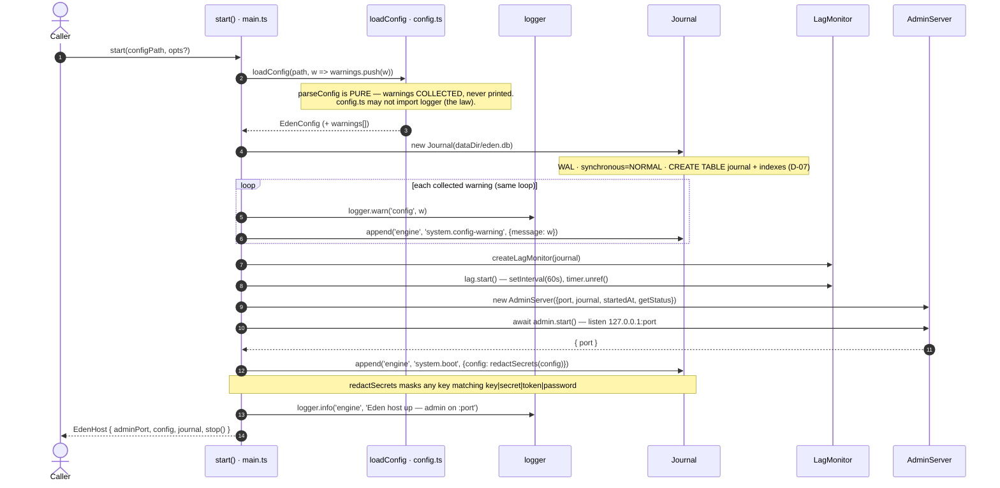
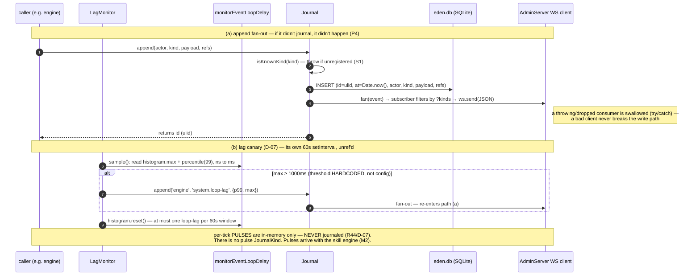

# 15 — M0 spine, as built

An **as-built** companion to [11-class-model.md](11-class-model.md) (class model) and
[12-architecture-views.md](12-architecture-views.md) (dynamic views). Those two describe
the **M0–M7 target**; this doc describes only the **M0 spine that exists today** under
[eden/src/](../eden/src). Every class, method, and import edge below was read out of the
code — nothing here is design that isn't yet built. Where the code diverges from doc 11 (it
does, in three small places — see §2), the **code wins** and the difference is called out.

What M0 actually is: `config → journal → lag-monitor → admin`, wired by `main.start()`,
journalling `system.boot`. No bots, no skills, no LLM, no God, no villagers — those layers
(2 and 3) are **not yet built**. They attach to the same composition root as their
milestones land.

**Rendering without GitHub:** open [15-m0-as-built.html](15-m0-as-built.html) in a browser
(needs internet for the mermaid CDN). Regenerate after editing with
`node docs/render-docs.mjs 15-m0-as-built.md`.

---

## 1. Package / layer diagram — the dependency law, as built for M0

This is the subset of [11 §1](11-class-model.md#1-package--layer-overview-the-dependency-law)
that has real files. Only **actual import edges** are drawn; each is labelled with the
[`.dependency-cruiser.cjs`](../eden/.dependency-cruiser.cjs) rule it obeys.



Reading the edges against the code:

- **`journal/journal` → `types/` + `journal/kinds`** ([journal.ts:9-10](../eden/src/journal/journal.ts)).
  `JournalEvent`/`Refs`/`JournalQuery` are type-only; `isKnownKind` (a value) comes from the
  registry. The only journal-side outbound edge the `journal-only-types` rule allows.
- **`journal/lag-monitor` → `journal/journal`** ([lag-monitor.ts:8](../eden/src/journal/lag-monitor.ts)) —
  imports the narrow `JournalAppender` (the write side), not the whole `Journal`.
- **`admin/server` → `types/` + `journal/journal` + `journal/kinds`** ([server.ts:10-12](../eden/src/admin/server.ts)).
  Admin imports downward freely, and the `no-import-admin` rule forbids anything but
  `main.ts` from importing it: delete `admin/` and the spine still boots.
- **`main` → config, logger, journal/journal, journal/lag-monitor, admin/server**
  ([main.ts:10-14](../eden/src/main.ts)). `main` notably does **not** import `types/` or
  `journal/kinds` directly — it touches them only through the modules it wires.
- **`config.ts`, `logger.ts`, `journal/kinds.ts` have *no* local imports at all** (verified:
  only `node:*` / npm deps). The law *permits* `config → types` (rule `config-only-types`)
  and `kinds` sits inside `journal/`, but as built they are self-contained leaves — `config`
  inlines its own `EdenConfig`/`*Config` interfaces rather than importing them from `types/`.
  The diagram draws no phantom edge for a permission the code doesn't exercise.
- Inside `types/` the only edges are submodule → `enums` (`events`/`task`/`skill` import
  `Priority`/`Tier`/… — [events.ts:1](../eden/src/types/events.ts)); the law forbids only
  `types/ → non-types`, so these stay hidden inside the L0 box.

**Layers 2 and 3 do not exist yet.** The greyed node marks where M1+ wires in; it is
deliberately not a set of classes (no `BotPool`, `SkillEngine`, `GodService`, …).

---

## 2. Class diagram — the types + classes M0 actually ships

L0 enums are shown as their union members; the L0 interfaces split into **journal types
with a live M0 consumer** (`JournalEvent`, `Refs`, `JournalQuery` — read by `journal` and
`admin`) and **everything else, which is defined but has no M0 consumer** — marked
«defined, used from M1+». L1 is the substrate; the consumer is `AdminServer`; the root is
`Main`/`EdenHost`. Test fakes live in their own box and are never shipped.



### The one deliberate seam — `JournalEvent.kind: string` vs the `JournalKind` union

This is the single place M0 code is *designed* to diverge from a naive reading of doc 11.
`types/JournalEvent.kind` is typed **`string`** ([types/journal.ts:24-34](../eden/src/types/journal.ts)),
**not** `JournalKind`. The reason is the dependency law: `types/` imports nothing, so it
cannot hold the canonical union. The union + per-kind payload shapes live one layer up in
[journal/kinds.ts](../eden/src/journal/kinds.ts) — the **S1 registry**: a `JOURNAL_KINDS`
`as const` array, a `KindPayloads` interface, and `KIND_REGISTRY` pinned with
`satisfies Record<JournalKind, KindDoc>` so a missing row is a compile error.

The thing that *enforces* the union at write time is therefore **not** the event type — it
is the writer's **generic `append<K>` signature**:

```typescript
// journal/kinds.ts — the source of truth (S1)
export const JOURNAL_KINDS = ['system.boot', 'system.config-warning', /* …6 total */] as const;
export type JournalKind = (typeof JOURNAL_KINDS)[number];
export interface KindPayloads {
  'system.boot': { config: object };
  'system.config-warning': { message: string };
  'system.loop-lag': { p99: number; max: number };
  // …one row per kind; missing a row is a compile error
}
export type PayloadOf<K extends JournalKind> = KindPayloads[K];

// types/journal.ts — the event stays open (so types/ imports nothing — the law)
export interface JournalEvent { kind: string; payload: object; /* … */ }

// journal/journal.ts — the writer binds K and forces the payload shape
append<K extends JournalKind>(actor: string, kind: K, payload: PayloadOf<K>, refs?: Refs): string
```

So writers get full type-safety (the compiler binds `K` to a registered kind and forces
`payload` to that kind's shape; a runtime `isKnownKind` guard at
[journal.ts:70](../eden/src/journal/journal.ts:70) backstops a bad dynamic kind), while
readers (`admin`) treat `kind` as the open `string` it is and render unknown kinds
generically via `describeKinds()`. This is doc 11's `JournalKindRegistry` as *actually*
built — a compile-time registry, **not** the runtime `register(kind, schema, doc)` method
doc 11 sketches.

Two smaller as-built divergences from doc 11, same direction (code wins):

1. **`EdenConfig.load()/validate()`** in doc 11 are, in code, the free functions
   `loadConfig`/`parseConfig` ([config.ts:154,315](../eden/src/config.ts)); `EdenConfig` is a
   pure data interface. `parseConfig` is **pure** — it *returns* warnings and never prints,
   because `config.ts` may not import `logger` (the law). `main` does the logging + journalling.
2. **`Journal`** also exposes `count()` and `close()` ([journal.ts:119,124](../eden/src/journal/journal.ts))
   beyond the doc-11 `append/query/subscribe` triad.

### Load-bearing M0 invariants visible above

- **One writer (S2):** `Journal` is the sole writer of `eden.db`; `MemoryJournal` is its
  test-only twin. Both realize the same `IJournal`, so consumers never know which they hold.
- **`console.*` only in `logger.ts` (R23):** the `Logger` interface is the one stdout seam;
  ESLint bans `console.*` elsewhere. That is *why* `parseConfig` returns warnings instead of
  printing them.
- **Admin is a deletable pure consumer:** the `no-import-admin` rule means only `main.ts`
  imports `admin/`; removing `admin/` cannot break the spine.
- **Lag threshold 1000 ms is hardcoded, not config (D-07):** `LagMonitor.thresholdMs`
  defaults to `1000` in `createLagMonitor` ([lag-monitor.ts:34](../eden/src/journal/lag-monitor.ts:34));
  nothing in `EdenConfig.journal` exposes it.

---

## 3. Sequence — boot (`main.start(configPath)`)

Traces [main.ts:28-69](../eden/src/main.ts) exactly: load config (warnings collected, **not**
printed — config can't import logger), open the WAL journal, replay each warning as a
`logger.warn` **and** a `system.config-warning` event in the same loop, start the lag canary,
start admin, journal `system.boot` with the config redacted, return the `EdenHost`.



The ordering matters: the journal is opened **before** warnings are emitted (they need a
writer), the lag monitor starts **before** admin (so the canary is armed the instant the
server can lag), and `system.boot` is the **last** append — its presence means a complete
boot. `stop()` reverses it: `lag.stop()` → `admin.stop()` → `journal.close()`.

---

## 4. Sequence — the two runtime data paths

After boot, M0 has exactly two live data paths: every `append` fans out to subscribers (the
admin WS stream is the only M0 subscriber), and the lag canary periodically samples the
event loop and may itself append. They share the same `Journal.append` → `fan` machinery, so
path (b) re-enters path (a).



Path (a) is [journal.ts:68-79 + fan:128-136](../eden/src/journal/journal.ts); the WS filter
is the connection handler at [server.ts:45-58](../eden/src/admin/server.ts) — a client
connecting to `/journal/stream?kinds=a,b` only receives events whose `kind` is in that list.
Path (b) is [lag-monitor.ts:40-49](../eden/src/journal/lag-monitor.ts): `sample()` converts
the histogram's nanosecond `max`/`p99` to ms, appends `system.loop-lag` only when
`max ≥ thresholdMs` (1000), then resets — so the canary fires at most once per reset window.

The pulse note is the load-bearing D-07 premise: the journal's synchronous writes are safe
on the shared event loop **because** the high-frequency progress signal (pulses) never
touches the journal at all. M0 has no pulses yet — but the rule is fixed now so M2's skill
engine inherits it, and the lag monitor is the canary that proves it stays true.

---

## 5. Traceability — every element to a real file:line

| Element | File:line |
|---|---|
| `Tier` / `SkillStatus` / `AbortCause` / `Priority` | [enums.ts:4,8,17,20](../eden/src/types/enums.ts) |
| `JournalEvent` / `Refs` / `JournalQuery` | [types/journal.ts:24,5,36](../eden/src/types/journal.ts) |
| `RunReport` (M1+) | [skill.ts:80](../eden/src/types/skill.ts) |
| `Task` / `Verdict` (M1+) | [task.ts:9,68](../eden/src/types/task.ts) |
| `Subscription` (M1+) | [events.ts:60](../eden/src/types/events.ts) |
| `Inbox` (M1+) | [inbox.ts:13](../eden/src/types/inbox.ts) |
| `EdenConfig` / `DeskConfig` / `ProviderConfig` / `VillagerConfig` | [config.ts:25,11,14,19](../eden/src/config.ts) |
| `DEFAULT_CONFIG` / `parseConfig` / `loadConfig` | [config.ts:60,154,315](../eden/src/config.ts) |
| `Logger` / `logger` | [logger.ts:12,24](../eden/src/logger.ts) |
| `JOURNAL_KINDS` / `KindPayloads` / `PayloadOf` / `KIND_REGISTRY` / `isKnownKind` / `describeKinds` | [kinds.ts:6,22,32,38,49,54](../eden/src/journal/kinds.ts) |
| `IJournal` / `JournalAppender` | [journal.ts:18,25](../eden/src/journal/journal.ts) |
| `Journal` (`append`/`query`/`subscribe`/`count`/`close`/`fan`) | [journal.ts:38,68,81,114,119,124,128](../eden/src/journal/journal.ts) |
| `LagMonitor` / `LagSample` / `createLagMonitor` (`sample`/`start`/`stop`) | [lag-monitor.ts:22,16,32,40,51,58](../eden/src/journal/lag-monitor.ts) |
| `AdminServer` (`start`/`stop`/`port`/`route`/WS upgrade) | [server.ts:22,61,70,77,81,37](../eden/src/admin/server.ts) |
| `EdenHost` / `start` / `redactSecrets` | [main.ts:21,28,73](../eden/src/main.ts) |
| `MemoryJournal` / `FakeBot` / `ScriptedLlm` (test-only) | [memory-journal.ts:8](../eden/tests/fakes/memory-journal.ts) · [fake-bot.ts:48](../eden/tests/fakes/fake-bot.ts) · [scripted-llm.ts:20](../eden/tests/fakes/scripted-llm.ts) |
| Dependency law (the rules cited above) | [.dependency-cruiser.cjs](../eden/.dependency-cruiser.cjs) |

---

A one-line pointer to this doc is recorded in [PROGRESS.md](PROGRESS.md) under the
`2026-06-13 — M0 (spine)` section (S8: behaviour + docs change in the same commit).
